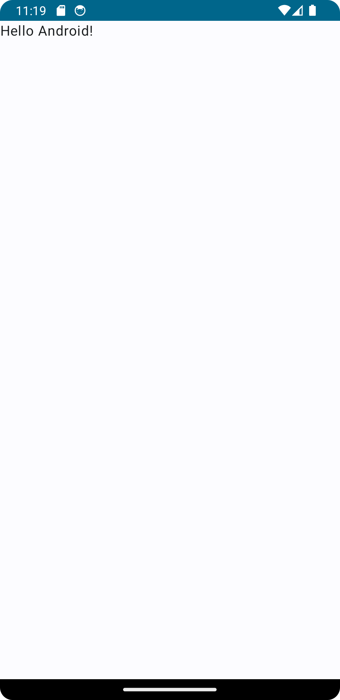
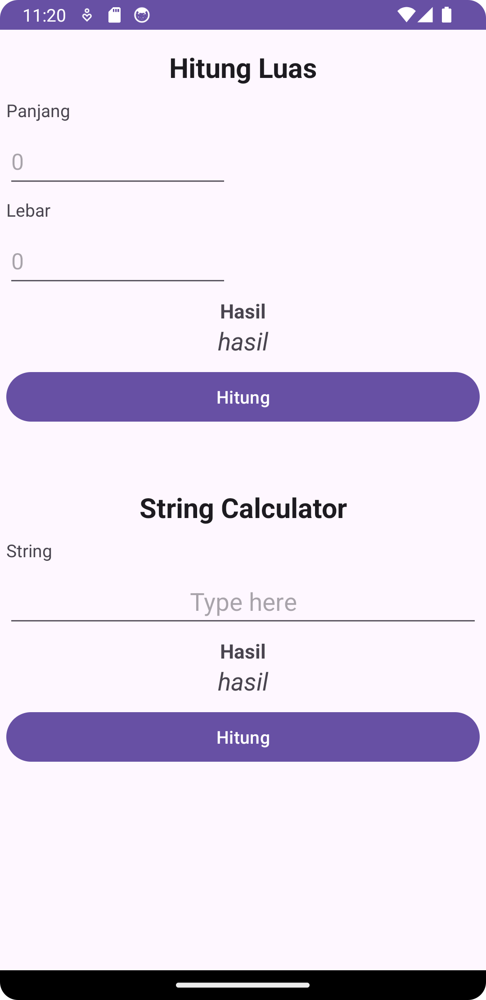
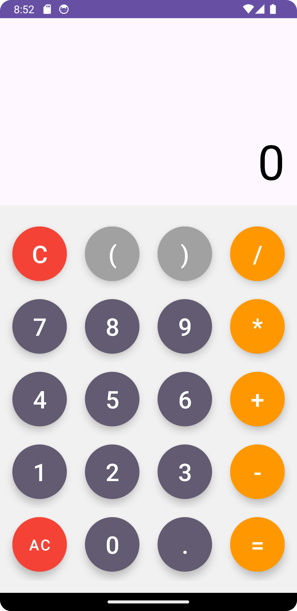
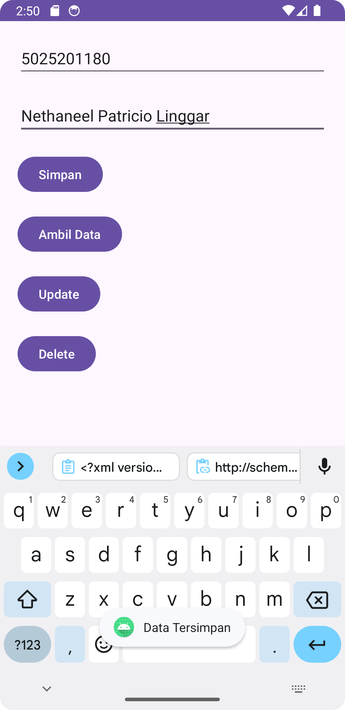
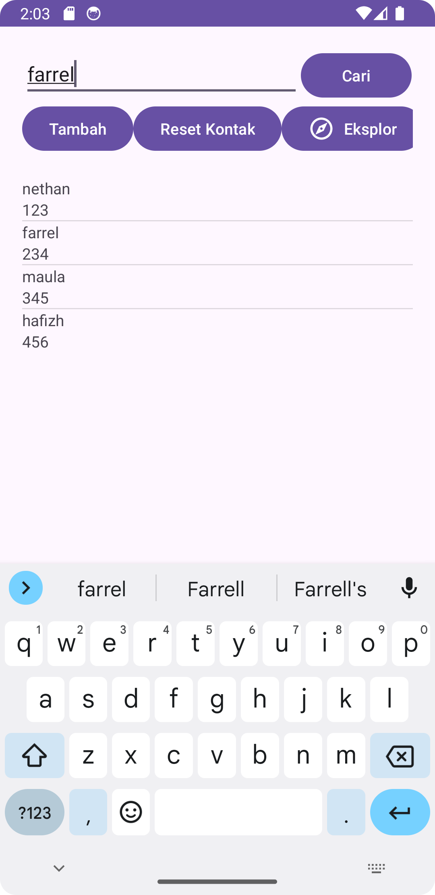
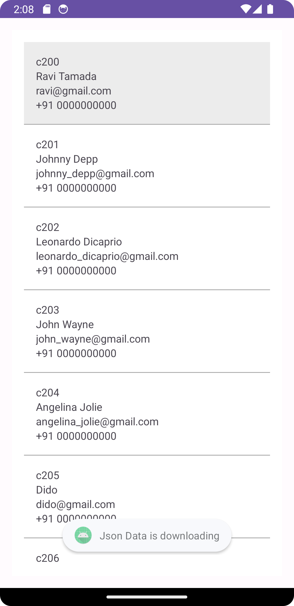

# Mobile Programming (Pemrograman Perangkat Bergerak) C
Assignment repository for the Mobile Programming course.

## Submission 1 - View
- Project description: Initiate a View in Android
- Project link: [Project Demo](https://youtu.be/jARSNQgwU-Y)

    

## Submission 2A - Hitung Luas
- Project description: Create an Android app that would calculate the Area given a Length and Width
- Project link: [Project Demo](https://youtu.be/jARSNQgwU-Y)

    

## Submission 2B - Kalkulator
- Project description: Create an Android calculator app
- Project link: [Project Demo](https://youtu.be/_rDw-d4toSA)

    

## Submission 3 - CRUD SQLite
- Project description: Create an Android app that integrates with SQLite
- Project link: [Project Demo](https://youtu.be/NznmIYZGGFY)

    

## Submission 4 - Dialogue Box
- Project description: Create an Android app that has a dialogue box
- Project link: [Project Demo](https://youtu.be/NznmIYZGGFY)

    

## Submission 5 - List View 
- Project description: Create a contacts ListView on an Android app that connects with SQLite
- Project link: [Project Demo](https://youtu.be/dfbZ6GwSiNw)

    

## Submission 6 - JSON Parser
- Project description: Create an Android app that could parse a JSON file
- Project link: [Project Demo](https://youtu.be/oGO8WJo5mz4)

    

